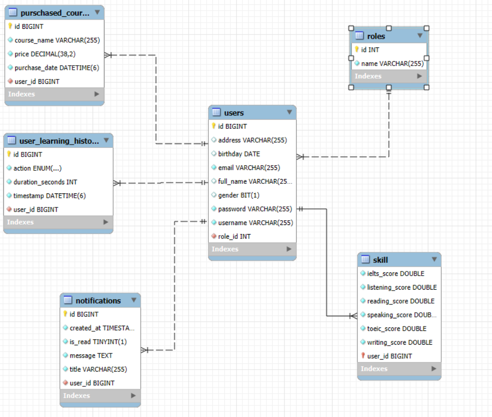
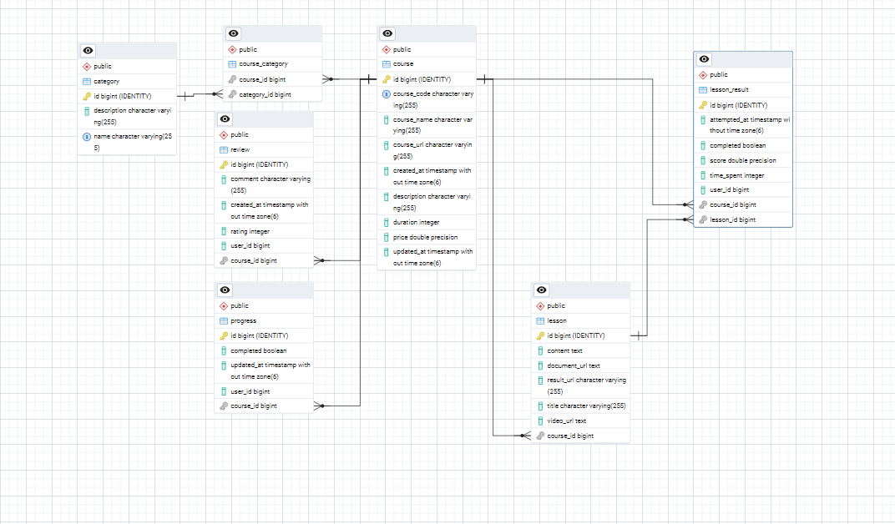
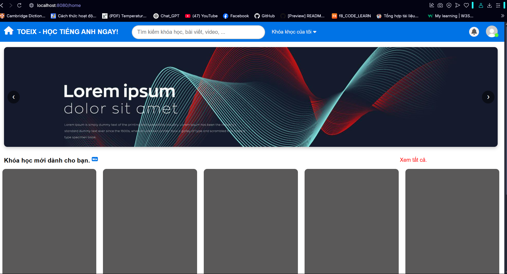
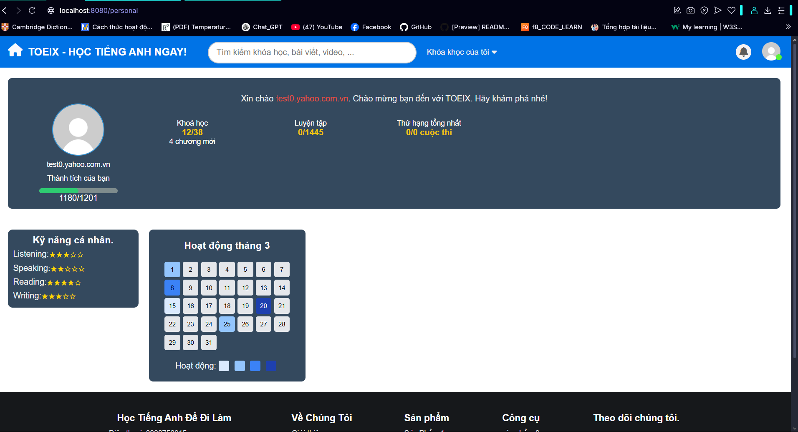
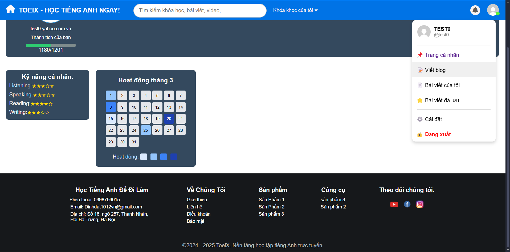

# 📌 TOEIX - Hệ thống học tiếng Anh cho người Lười.  

🚀 **TOEIX** là một hệ thống hỗ trợ học tiếng Anh trực tuyến dành cho người đi làm, giúp cải thiện kỹ năng ngôn ngữ thông qua các bài học, bài kiểm tra và phân tích tiến độ học tập.

---

## 📜 Mục lục  
- [✨ Tính năng](#-tính-năng)  
- [🛠️ Công nghệ sử dụng](#️-công-nghệ-sử-dụng)  
- [⚙️ Cài đặt](#️-cài-đặt)  
- [▶️ Cách chạy dự án](#️-cách-chạy-dự-án)  
- [📬 Liên hệ](#-liên-hệ)  

---

## ✨ Tính năng  
✔️ **Xác thực & Phân quyền:** Đăng nhập/đăng ký bằng tài khoản, xác thực JWT, phân quyền User/Admin.  
✔️ **Bài học & Bài tập:** Cung cấp tài liệu học tập, bài kiểm tra trắc nghiệm, và bài tập thực hành.  
✔️ **Chấm điểm & Theo dõi tiến độ:** Hệ thống tự động chấm điểm, thống kê kết quả và đề xuất bài học phù hợp.  
✔️ **Giao diện thân thiện:** Responsive UI giúp người dùng trải nghiệm tốt trên cả PC và mobile.  

---

## 🛠️ Công nghệ sử dụng  
- **Back-end:** Java Spring Boot, Spring Security, JWT, Hibernate  
- **Front-end:** React.js, Redux, TailwindCSS  
- **Database:** PostgreSQL/MySQL  
- **DevOps:** Docker, CI/CD với GitHub Actions  

---
----
##📬 Liên hệ
- **📧 Email: dinhdat1012vn@gmail.com
- **🔗 GitHub: DinhDat-1012
- **📌 Hãy 🌟 Star repository nếu bạn thấy dự án hữu ích! 🚀

## ⚙️ Cài đặt  
### 1️⃣ Clone repository  
```bash
git clone https://github.com/DinhDat-1012/TOEIX.git
cd TOEIX
```
### Analysis and design system

##

## List API
| Method | Endpoint                    | Mô tả                                  | Yêu cầu Token |
| ------ |-----------------------------|----------------------------------------| ------------- |
| GET    | `/api//v1/products/course`  | Lấy danh sách tất cả khóa học (public) | ❌             |
| GET    | `/api/products/public`      | Lấy danh sách khóa học public          | ❌             |
| GET    | `/api/products/public/{id}` | Chi tiết khóa học public               | ❌             |
| GET    | `/api/products`             | Lấy tất cả khóa học                    | ✅             |
| GET    | `/api/products/{id}`        | Chi tiết khóa học                      | ✅             |
| GET    | `/api/products/search`      | Tìm kiếm khóa học theo từ khóa         | ✅             |
| GET    | `/api/products/filter`      | Lọc khóa học theo level                | ✅             |
| GET    | `/api/products/page`        | Lấy khóa học có phân trang             | ✅             |
| POST   | `/api/products`             | Thêm khóa học mới                      | ✅ (ADMIN)     |
| PUT    | `/api/products/{id}`        | Cập nhật khóa học                      | ✅ (ADMIN)     |
| DELETE | `/api/products/{id}`        | Xóa khóa học                           | ✅ (ADMIN)     |
| PATCH  | `/api/products/{id}/status` | Thay đổi trạng thái khóa học           | ✅ (ADMIN)     |
| GET    | `/api/products/{id}/stats`  | Thống kê khóa học                      | ✅ (ADMIN)     |
| GET    | `/api/products/recommend`   | Gợi ý khóa học cho người dùng          | ✅             |

## Database

### UserService MYSQL

### ProductService (POSTGESQL)

### img


